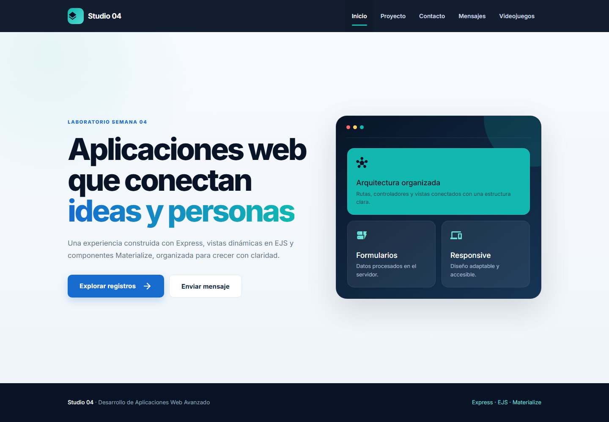
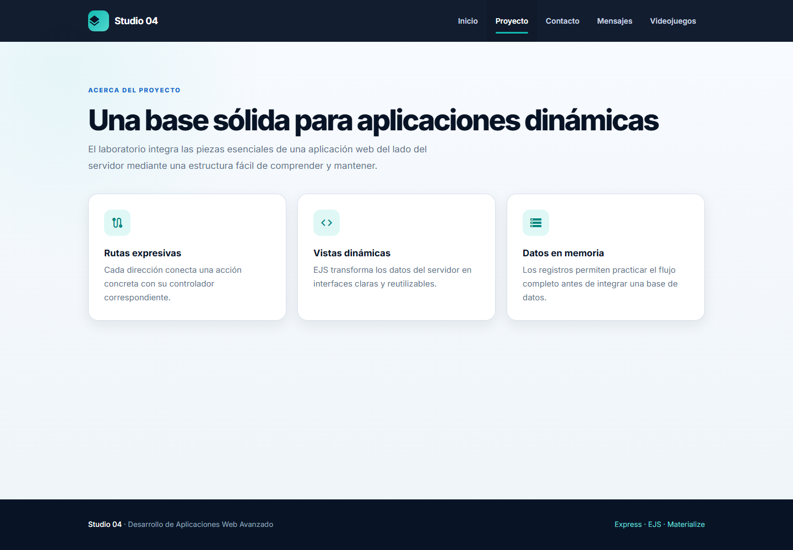
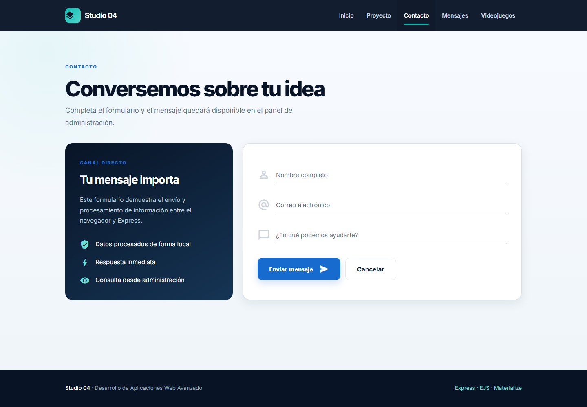
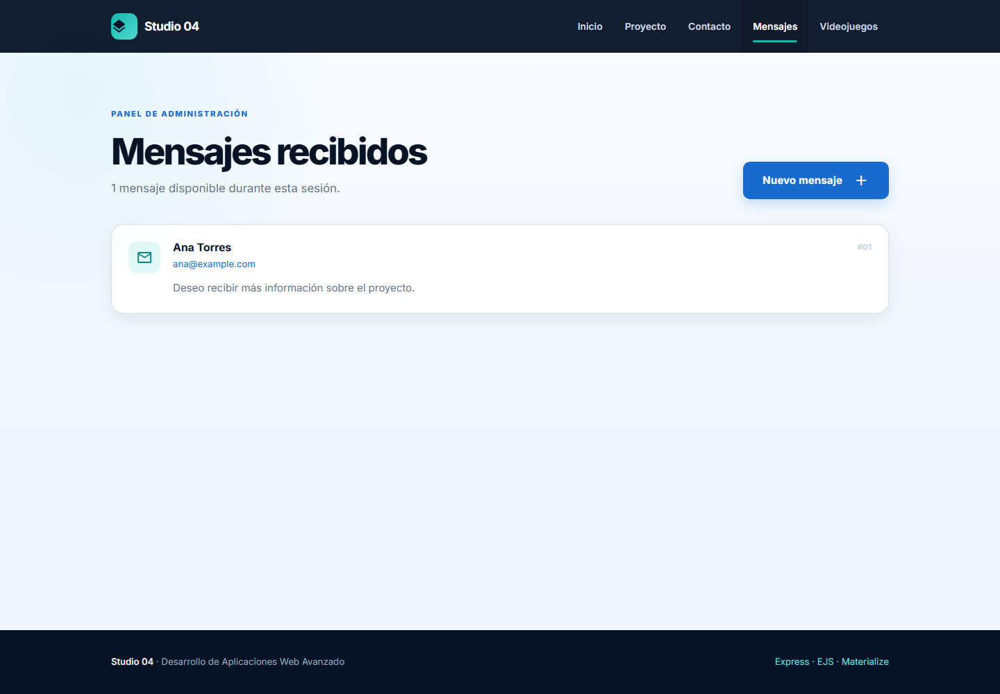
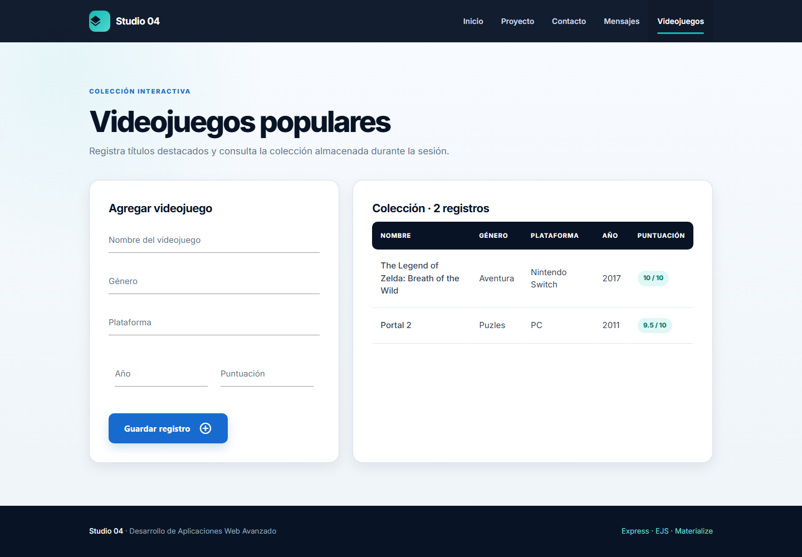
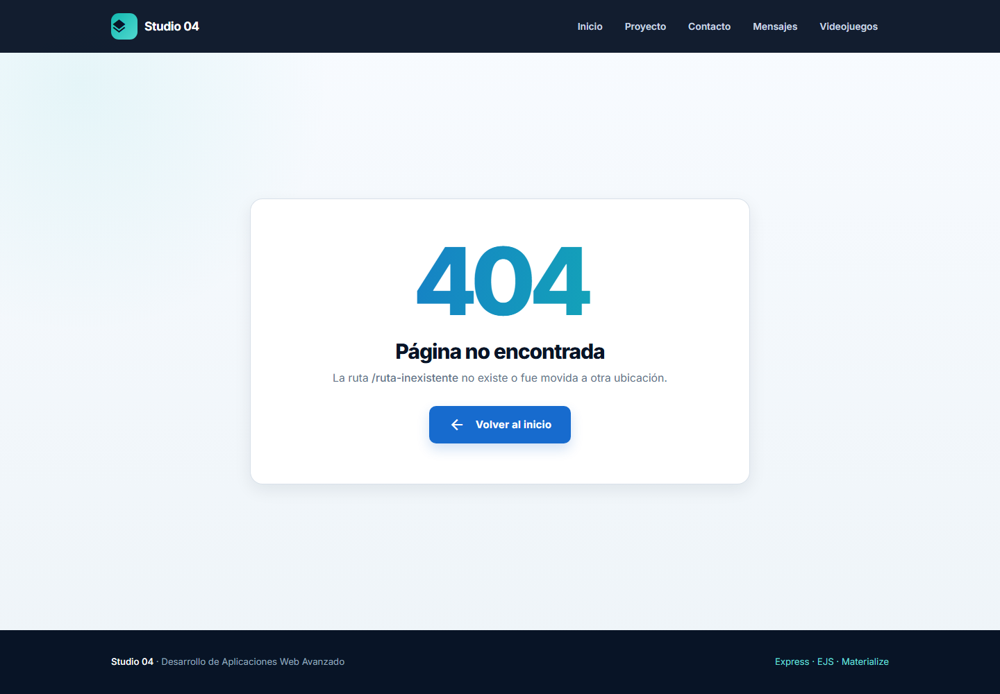

# Sitio web con Express

Aplicación web desarrollada durante la Semana 04 del curso Desarrollo de Aplicaciones Web Avanzado. El proyecto utiliza Express, EJS y Materialize para implementar navegación, formularios, almacenamiento temporal en memoria y manejo de errores.

<a href="https://trendshift.io/repositories/28176?utm_source=repository-badge&amp;utm_medium=badge&amp;utm_campaign=badge-repository-28176" target="_blank" rel="noopener noreferrer"></a>

## Descripción

Este proyecto simula un pequeño sitio web con varias secciones:

- Página principal
- Información institucional
- Formulario de contacto
- Panel de administración
- Registro y listado de videojuegos
- Página 404 personalizada

La información ingresada por el usuario se guarda solo en memoria mientras el servidor está activo, lo que hace que el ejercicio sea ideal para practicar conceptos básicos de Express y renderizado con EJS.

## Requisitos previos

Antes de ejecutar este proyecto asegúrate de tener instalado:

- Node.js 18 o superior
- npm o yarn
- Git

## Clonación del repositorio

```bash
git clone https://github.com/C5-PHO/DAWA-S4.git
```

Si prefieres trabajar desde tu entorno local con otra ruta, puedes clonar en cualquier carpeta y luego entrar al proyecto:

```bash
git clone <URL_DEL_REPOSITORIO>
cd <carpeta-del-proyecto>/Semana04
```

## Instalación de dependencias

Dentro de la carpeta `Semana04`, ejecuta:

```bash
npm install
```

## Ejecución

Inicia la aplicación con:

```bash
npm start
```

Luego abre tu navegador en:

[http://localhost:3000](http://localhost:3000)


## Funcionalidades

- Página de inicio y página informativa.
- Formulario de contacto.
- Almacenamiento de mensajes en memoria.
- Panel de administración para consultar mensajes.
- Registro y listado de videojuegos con cinco campos.
- Página personalizada para errores 404.
- Interfaz basada en Materialize CSS.

## Tecnologías

- Node.js
- Express
- EJS
- Materialize CSS

## Rutas

| Método | Ruta | Descripción |
| --- | --- | --- |
| GET | `/` | Página de inicio |
| GET | `/about` | Información del sitio |
| GET | `/contact` | Formulario de contacto |
| POST | `/contact` | Registra un mensaje en memoria |
| GET | `/admin` | Lista los mensajes recibidos |
| GET | `/games` | Formulario y listado de videojuegos |
| POST | `/games` | Registra un videojuego en memoria |

## Pruebas

```bash
npm test
```

Las pruebas verifican las rutas principales, el envío de ambos formularios, la persistencia temporal de los registros y la respuesta 404.

## Capturas

### Inicio



### Proyecto



### Contacto



### Administración



### Videojuegos



### Error 404



## Repositorio

[https://github.com/C5-PHO/DAWA-S4](https://github.com/C5-PHO/DAWA-S4)

> Los mensajes y videojuegos se almacenan únicamente en memoria y se reinician cuando se detiene el servidor.

## Notas finales

- Si quieres probar la aplicación desde cero, borra la sesión del navegador para ver los mensajes iniciales.
- El proyecto está pensado como ejercicio práctico de rutas, formularios y vistas en Express.
- Para seguir desarrollando la app, puedes extender la lógica de almacenamiento a una base de datos real.
